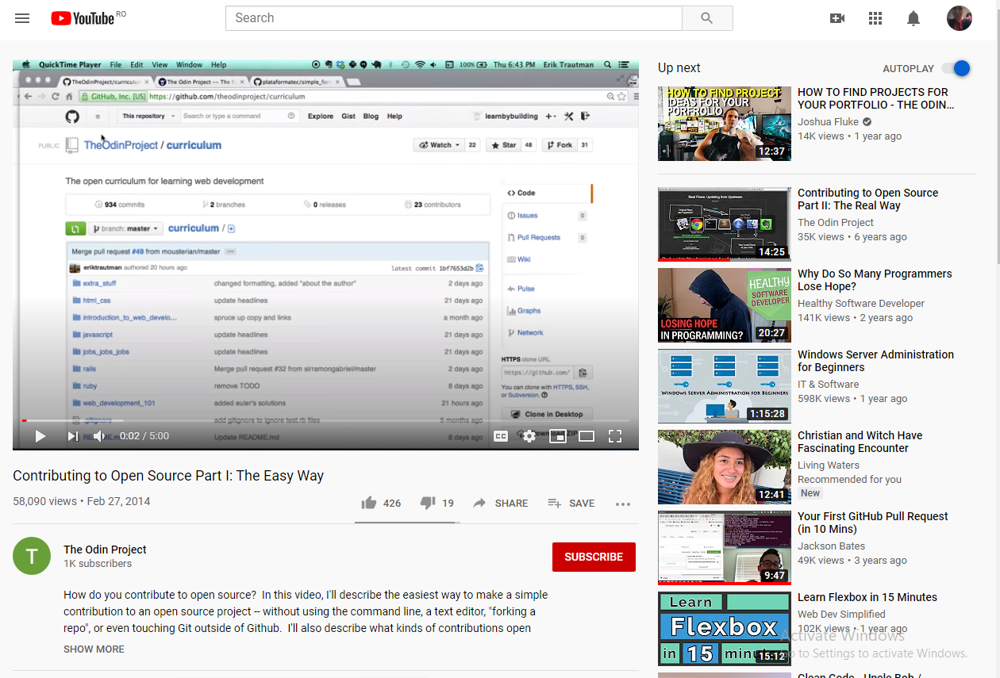

# Embedding Images and Video

> This is a youtube homepage clone using HTML and CSS3.

Additional description about the project and its features.

## Built With

- HTML,
- CSS3

## Live Demo

[Live Demo Link](https://cristianceamatu.github.io/microverse-Embedding-Images-and-Video)

## This is a simple HTML and CSS3 built clone and does not require any scripts or installations.

## Authors

👤 **Cristian Viorel Ceamatu**

- Github: [@githubhandle](https://github.com/cristianCeamatu)
- Twitter: [@twitterhandle](https://twitter.com/CeamatuV)
- Linkedin: [linkedin](https://www.linkedin.com/in/ceamatu-cristian-viorel-7a5469136/)

👤 **Mkrtich Sargsyan**

- Github: [@githubhandle](https://github.com/MkrtichSargsyan)
- Twitter: [@twitterhandle](https://twitter.com/MkrtichSargsyan)
- Linkedin: [linkedin](https://www.linkedin.com/in/mkrtich-sargsyan-921ab0152/)

## 🤝 Contributing

Contributions, issues and feature requests are welcome!

Feel free to check the [issues page](issues/).

## Show your support

Give a ⭐️ if you like this project!

## Acknowledgments

- Hat tip to anyone whose code was used
- Inspiration
- etc

## 📝 License

This project is [MIT](lic.url) licensed.
